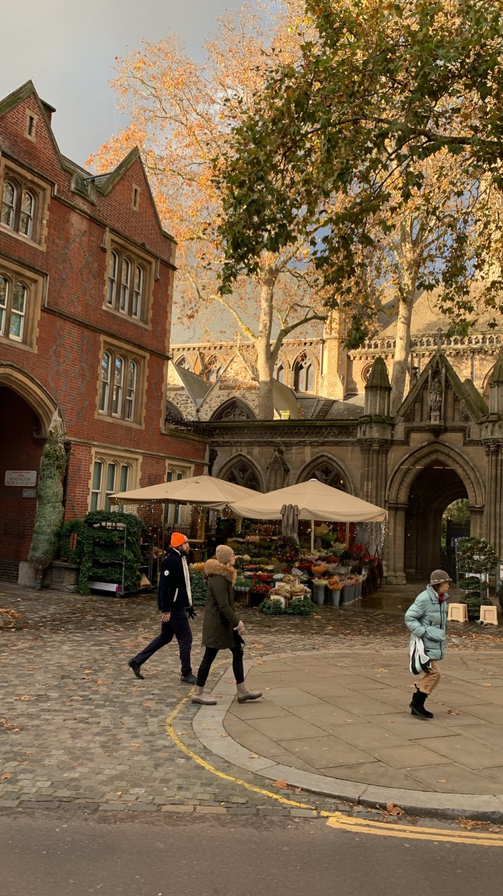

# Taipei Trip Helper

## Utility
* Map: <a href = "https://www.google.com/maps/d/edit?mid=1NjCiEKEqH52f1iyqM8s2l0BiHiMQXes&usp=sharing" target = "_blank"> Click me </a>

* 台北到基隆: <a href = "https://github.com/HonAnson/Littlewebsite.github.io.githttps://taiwanplay.com/taipei-keelung/#%E5%8F%B0%E5%8C%97%E5%88%B0%E5%9F%BA%E9%9A%86%E7%9A%84%E5%A4%A7%E7%9C%BE%E9%81%8B%E8%BC%B8" target = "_blank"> Click me </a>

* 台北到宜蘭: <a href = "https://taiwanplay.com/taipei-yilan/" target = "_blank"> Click me </a>

<!-- # Japan Trip Helper
A helper for japan trip.

## Utilities
- Weather: <a href="https://www.japan.travel/en/weather/" target="_blank">Link Here ☀️ 🌥</a>
- Coin Lockers: <a href="https://coinlocker.click/" target="_blank">Link Here 🔒</a>
- TabeLog 百名店: <a href="https://award.tabelog.com/hyakumeiten" target="_blank">Link Here 🍲 🍊 🫛 🥟 ☕ 🍧</a>
- JR West Map: <a href="https://global.trafficinfo.westjr.co.jp/tc/" target="_blank">Link Here  🗺️ </a>

## 広島  

  

- Tabelog ranking: <a href="https://tabelog.com/hiroshima/rstLst/?Srt=D&SrtT=rvcn&svd=20240630&svt=1900&svps=2" target="_blank">Link Here 🍴</a>
- Hiroshima Tourist Pass: <a href="https://tw.wamazing.com/ticket/tickets/visit_hiroshima_tourist_pass" target="_blank">Link Here 🎫</a>
- Official Hiroshima Info: <a href="https://dive-hiroshima.com/tw/" target="_blank">Link Here 🔗</a>

## 倉敷  

     

- 倉敷 Tabelog Ranking: <a href="https://tabelog.com/okayama/C33202/rstLst/?Srt=D&SrtT=rvcn&svd=20240630&svt=1900&svps=2" target="_blank">Link Here 🍴</a>
- Tourist blog: <a href="https://journey.tw/go-kurashiki-city/" target="_blank">Link Here 📝</a>

## 大阪  

  

🚧 Under Construction! 🚧  

 -->

<!-- 

  

 Figure 1. A nice flower shop I saw in London today. -->
